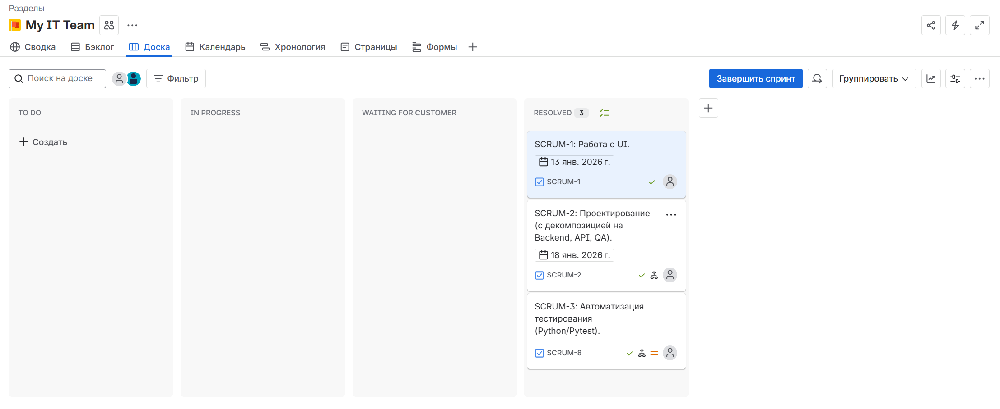
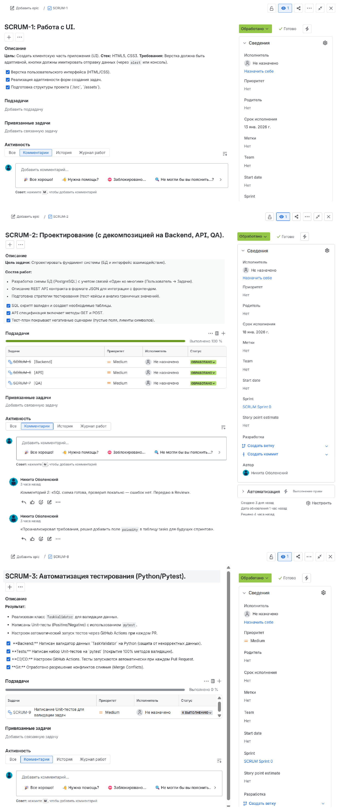

# 🚀 Enterprise Task Tracker


**Учебная симуляция разработки Enterprise-системы.**
В этом проекте реализован полный цикл разработки ПО (SDLC): от проектирования базы данных и API до написания автотестов и настройки CI/CD пайплайна.

---

## 🛠 Технический стек
* **Core:** Python 3.10 (Business Logic)
* **Database:** SQL (PostgreSQL/MySQL schema design)
Схема БД и примеры аналитических запросов находятся в директории /db
* **Testing:** Pytest (Unit Testing, Positive/Negative scenarios)
* **DevOps:** GitHub Actions (CI/CD), Git Flow
* **Frontend:** HTML5, CSS3

---

## 🗺 Roadmap и Реализованные Спринты

Проект был разбит на 3 спринта по методологии Scrum. Все задачи успешно выполнены.

### ✅ Спринт 1: Frontend (UI/UX)
* [x] Верстка пользовательского интерфейса (HTML/CSS).
* [x] Реализация адаптивности форм создания задач.
* [x] Подготовка структуры проекта (`/src`, `/assets`).

### ✅ Спринт 2: Architecture & Design
* [x] **Database:** Разработана схема БД (3NF, Foreign Keys, Constraints). См. `db/schema.sql`.
* [x] **API:** Спроектирована спецификация REST API (JSON Contract). См. `docs/api_v1.json`.
* [x] **QA Theory:** Создан тест-план и анализ граничных значений. См. `docs/TEST_DESIGN.md`.

### ✅ Спринт 3: Automation & CI/CD
* [x] **Backend:** Написан валидатор данных `TaskValidator` на Python (защита от некорректных данных).
* [x] **Tests:** Написан набор Unit-тестов на `pytest` (покрытие 100% методов валидации).
* [x] **CI/CD:** Настроен GitHub Actions. Тесты запускаются автоматически при каждом Pull Request.
* [x] **Git:** Отработано разрешение конфликтов слияния (Merge Conflicts).

---

## ⚙️ Управление проектом (Workflow)

Работа велась по Agile/Scrum с использованием Jira. Это позволило имитировать реальный производственный процесс.

### 1. Scrum Board (Финал)
Все задачи прошли полный жизненный цикл: `To Do` -> `In Progress` -> `Code Review` -> `Done`.



### 2. Декомпозиция задач
Каждая задача (User Story) была декомпозирована на технические подзадачи (Sub-tasks). Применялись критерии приемки (Acceptance Criteria).



---

## 🚀 Как запустить тесты
Проект настроен на автоматический запуск в облаке, но можно запустить и локально:

1. Установить зависимости:
    ```bash
   pip install pytest

2. Запустить тесты:
    ```bash
    python -m pytest

Автор: Nikita Obolensky